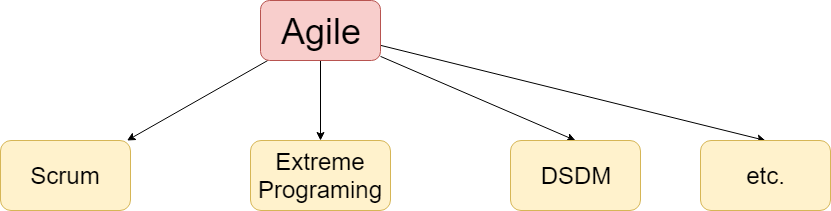
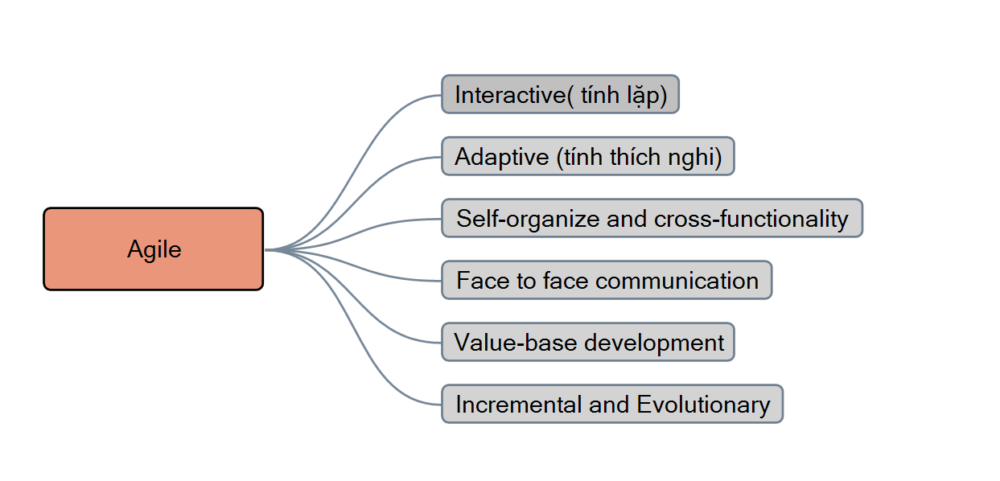
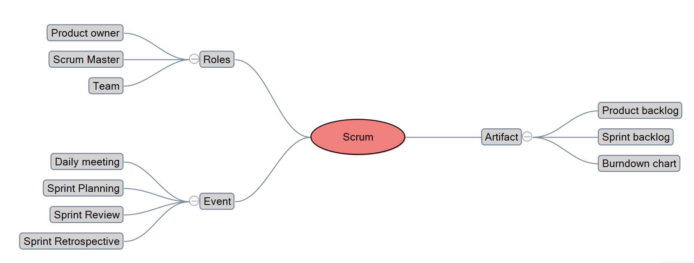

**1. Agile Definition**

**Agile Manifesto**
- ***Individuals and interactions*** over processes and tools
- ***Working software*** over comprehensive documentation
- ***Customer collaboration*** over contract negotiation
- ***Responding*** to change over following a plan

**Agile Characteristics**

**2. Scrum**

**Roles:**

- Product Owner:
  - Define the features of the product
  - Decide on release date and content
  - Be responsible for the profitability of the product
(Return On Investment)
  - Prioritize features according to market value
  - Adjust features and priority every iteration, as
needed
  - Accept or reject work results.
  
- Scrum master:
  - Represents management to the project
  - Responsible for enacting Scrum values and practices
  - Removes impediments
  - Ensure that the team is fully functional and productive
  - Enable close cooperation across all roles and
  functions
  - Shield the team from external interferences
  
- Team
  - Typically 5-10 people
  - Cross-functional
  - QA, Programmers, UI Designers, etc.
  - Members should be full-time
  - May be exceptions (e.g., System Admin, etc.)
  - Teams are self-organizing
  - What to do if a team self-organizes someone off the team??
  - Ideally, no titles but rarely a possibility
  - Membership can change only between sprints

**Events:**
- Sprint planning:
  - plan tasks in the next sprint with priority, and time

- Daily meeting:
  - 15 minutes
  - discuss about: 
    - Work yesterday
    - Work today
    - issues

- Sprint review:
  - <= 2 hours
  - Team presents what it accomplished
during the sprint
  - Typically takes the form of a demo of new
features or underlying architecture

- Sprint Retrospective
  - Get feedback
  - Start doing ...
  - Stop doing ...
  - Continue doing

**Artifacts:**

- Product backlog
  - list of all task to make the project work with priority

- Sprint backlog
  - plan for a sprint, a result of a sprint planning meeting
  - analyze priority and time

- Burndown chart
  - Depicts the total Sprint Backlog hours
  - remaining per day
  - Shows the estimated amount of time to
release
  - Ideally should burn down to zero to the
end of the Sprint
