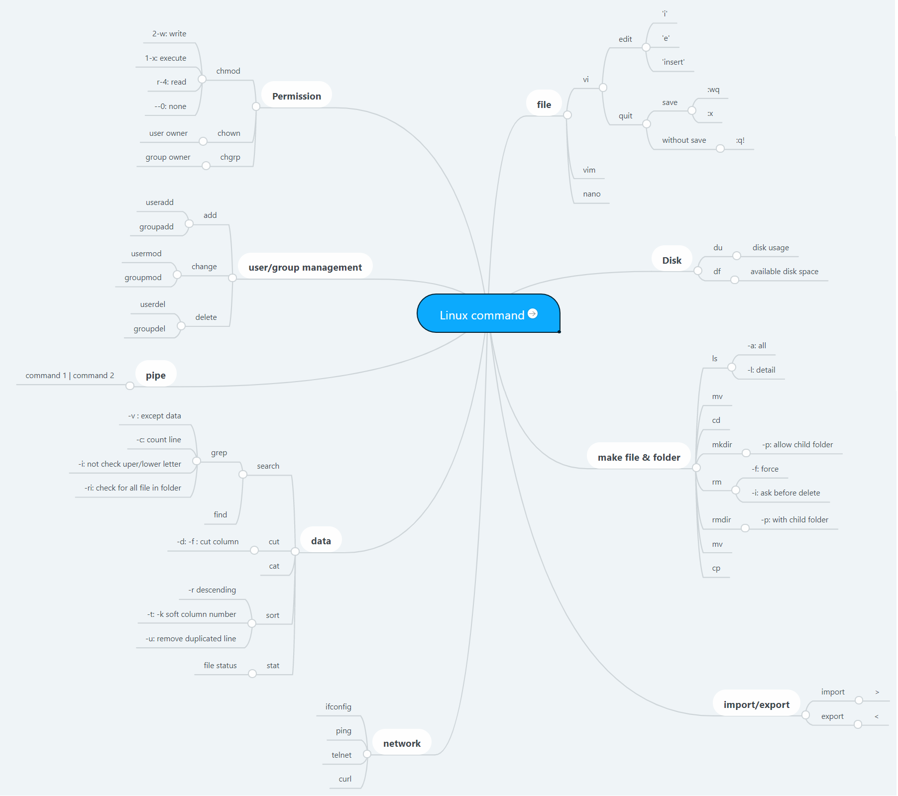
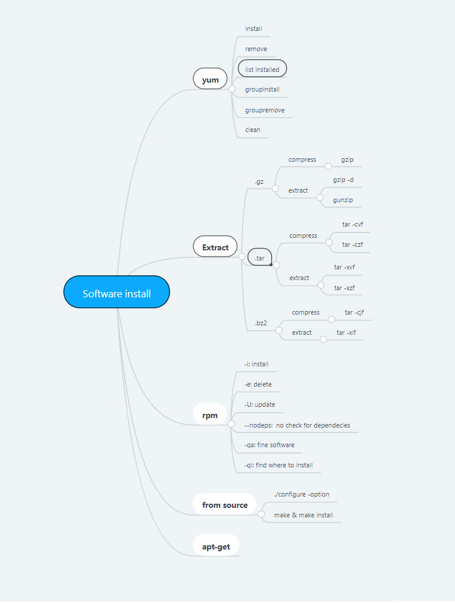

**1. System File**

- Relative path: start without "/"
  - Ex: etc/sysconfig 
- Absolute path: start with "/"
  - Ex: /etc/sysconfig
- Special path:
  - present folder: "."
  - upper folder: ".."

**2. common linux command**

**3. Software install**

**4. Linux tips**

- shopt -s cdspell => correct spelling misstake in cd command

**5. Linux regex:**
"^string": start with "string"
"string$": end with "string"
"^$": empty