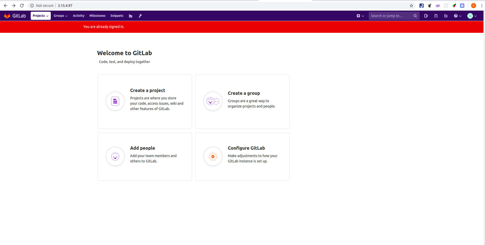

# Cài đặt Gitlab Omnibus :star:

## Mục lục :book:

1. [Cài đặt và cấu hình những dependencies cần thiết](#install-dependencies)
2. [Thêm gói cài đặt gitlab](#add-package)
3. [Cài đặt gitlab](#install-gitlab)

---

<a id="install-dependencies"></a>

## Cài đặt và cấu hình những dependencies cần thiết :gear:

- Tiến hành cập nhật chỉ mục gói và cài đặt một số tool cần thiết như ***curl, openssh-server, ca-certificates***.

```bash
sudo apt-get update
sudo apt-get install -y curl openssh-server ca-certificates
```

- Trong đó:
  - ```curl```: Là một command line tool, và là thư viện được sử dụng để truyền dữ liệu qua nhiều giao thức khác nhau (như HTTP, HTTPS, FTP, FTPS, SCP, SFTP, FILE, IMAP, SMTP, POP3, RTSP và RTMP…).
  - ```openssh-server```: đầu tiên ta hiểu SSH (Secure Shell) là một giao thức mạng dùng để kết nối giữa Client và Server/VPS, giúp ta có thể truy cập máy chủ từ xa thì trên máy chủ đó chúng ta phải cài đặt một ssh server để có thể kết nối đến.
  - ```ca-certificates```: Một công cụ cho phép các ứng dụng dựa trên SSL kiểm tra tính xác thực của các kết nối SSL.

- Tiếp đến ta có thể tiến hành cài đặt mail server Postfix để gửi thông báo email hoặc cũng có thể bỏ qua bước này để cấu hình với một mail server khác bên ngoài.

  ```bash
  sudo apt-get install -y postfix
  ```

---

<a id="add-package"></a>

## Thêm gói cài đặt gitlab :package:

```bash
curl https://packages.gitlab.com/install/repositories/gitlab/gitlab-ee/script.deb.sh | sudo bash
```

---

<a id="install-gitlab"></a>

## Cài đặt gitlab :wrench:

- Tiến hành cài đặt gitlab với lệnh ```sudo apt-get install gitlab-ee```.

- Truy cập vào gitlab thông qua giao diện người dùng, thông thường mặc định gitlab sẽ mở ở cổng 80, ta có thể truy cập thông qua ```localhost```.

- Một màn hình hiển thị cài đặt mật khẩu mới của tài khoản **root** hiện lên tiến hành đặt mật khẩu mới và đăng nhập vào gitlab sẽ hiển thị màn hình **Welcome** như sau:

- Về database gitlab omnibus đã có bao gồm sẵn một postgresql.
- Thông thường omnibus-gitlab lưu trữ dữ liệu về git repository ở trong thư mục ```/var/opt/gitlab/git-data```. Kho chứa được lưu trong một thư mục con là ```repositories```.
- Để cấu hình gitlab ta chạy file ```/etc/gitlab/gitlab.rb``` để thêm hoặc sửa một số cài đặt khác.

---
