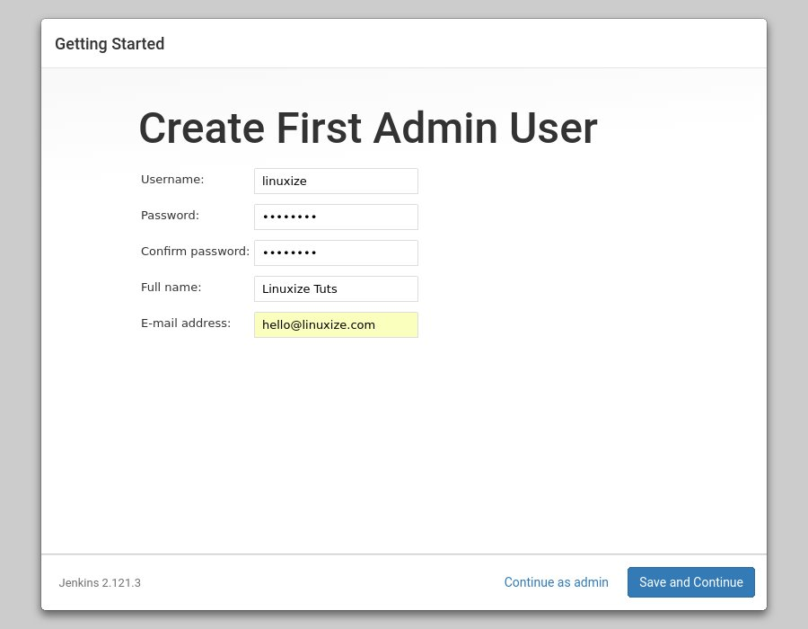

# Cài đặt Jenkins (Ubuntu) :stars:

## Mục lục :book:

1. [Cài đặt java](#prepare-env)
2. [Cài đặt Jenkins](#install-jenkins)
3. [Cấu hình Jenkins](#config-jenkins)

---

<a id="prepare-env"></a>

## Cài đặt java :gear:

- Đầu tiên tiến hành cài đặt java.
- Bởi vì jenkins không hỗ trợ tất cả các phiên bản java, nên chọn đúng version để việc cài đặt diễn ra đúng nhất:
  - version 2.164 và mới hơn sử dụng java 8 hoặc 11.
  - version 2.54 và mới hơn sử dụng java 8.
  - version 1.1612 và mới hơn java 7.
- Ở đây tiến hành cài đặt phiên bản 2.176.1 nên ta có thể cài đặt java 8.
- Tiến hành cài đặt java 8 trên ubuntu ```sudo apt install openjdk-8-jre-headless```.
- Sau khi cài đặt xong java tiến hành kiểm tra java đã được cài đặt hay chưa chạy lệnh ```java -version```.

---

<a id="install-jenkins"></a>

## Cài đặt Jenkins :package:

- Trên Debian-based distributions như là Ubuntu ta có thể cài đặt Jenkins thông qua apt.
- Trước khi tiến hành cài đặt ta tiến hành cập nhật chỉ mục gói và cập nhật phần mềm lên phiên bản mới nhất sẵn có:
  - ```sudo apt-get update```
  - ```sudo apt-get upgrade```
- Thêm Jenkins Debian repository, nếu trả về kết quả là **OK** thì thì có nghĩa là key đã được thêm vào thành công và những packages từ repository này sẽ được xem là đáng tin cậy:
  - ```wget -q -O - https://pkg.jenkins.io/debian/jenkins.io.key | sudo apt-key add -```
  - Lệnh trên có nghĩa là sẽ tải ```jenkins.io.key``` về, option -O là để đổi tên thành ```-``` khi tải về, option -q là để tắt wget output. Sau đó sử dụng lệnh ```sudo apt-ket add -``` để add key có tên là ```-```.

- Sau đó thêm Jenkins repository vào hệ thống với lệnh:
  - ```sudo sh -c 'echo deb https://pkg.jenkins.io/debian-stable binary/ > /etc/apt/sources.list.d/jenkins.list'```
  - Lệnh ```sh -c``` sẽ thực hiện một lệnh shell từ một chuỗi, ở trên là chạy lệnh ```echo deb https://pkg.jenkins.io/debian-stable binary/ > /etc/apt/sources.list.d/jenkins.list``` có nghĩa là ghi đoạn
```deb https://pkg.jenkins.io/debian-stable binary/``` vào trong file ```jenkins.list``` trong đó ```deb``` không phải là một command nó sẽ được sử dụng trong ```/etc/apt/sources.list.d/jenkins.list``` để biểu thị cho một Debian software repository.

- Sau khi Jenkins repository đã được kích hoạt, tiến hành cập nhật lại chỉ mục gói và sau đó bắt đầu cài đặt Jenkins.
  - ```sudo apt update```
  - ```sudo apt install jenkins```
- Khi cài đặt xong gói cài đặt này sẽ làm những việc sau:
  - Sau khi cài đặt nó sẽ cài đặt jenkins như một deamon (deamon nó giống như một chương trình chạy nền như service trên windows). Để có thêm thông tin xem trong```/etc/init.d/jenkins```
  - Tạo một user là jenkins để chạy service này.
  - Log được ghi vào trong file sau: ```/var/log/jenkins/jenkins.log``` khi jenkins bị lỗi có thể kiểm tra file này.
  - Lưu trữ những thông số cài đặt trong ```/etc/default/jenkins```
  - Cài đặt cho Jenkins lắng nghe ở cổng 8080.
  - Dữ liệu lưu trữ được lưu mặc định trong ```/var/lib/jenkins```
- Sau khi cài đặt xong gõ ```systemctl status jenkins``` để kiểm tra trạng thái của jenkins.
  - Về cơ bản ***systemctl*** là một thành phần của ***systemd*** dùng để quản lý các trạng thái dịch vụ của hệ thống (bắt đầu, kết thúc, khởi động lại hoặc kiểm tra trạng thái dịch vụ của hệ thống jenkins). Còn về ***systemd*** ở đây có thể thấy chữ ```d``` cuối cùng là ***deamon*** ý chỉ những cái gì âm thầm hoạt động trong linux nó là những tiến trình chạy dưới nền (background process). Nhưng systemd cũng không phải là để chỉ các tiến trình chạy ngầm đó, mà nó là một nhóm các chương trình đặc biệt sẽ quản lý, vận hành và theo dõi các tiến trình khác hoạt động.
  - Ta có thể sử dụng một số lệnh sau:
    - ```systemctl start jenkins``` chạy jenkins.
    - ```systemctl stop jenkins``` dừng jenkins.
    - ```systemctl enable jenkins``` chạy jenkins cùng với hệ thống.
    - ```systemctl disable jenkins``` vô hiệu hóa khi jenkins chạy cùng với hệ thống.

---

<a id="config-jenkins"></a>

## Config jenkins. :wrench:

- Sau khi cài đặt xong Jenkins ta tiến hành cấu hình nó.
- Tiến hành truy cập vào Jenkins thông qua loopback address hoặc địa chỉ public ip ví dụ: http://52.15.143.213:8080/.
- Sau đó ta sẽ thấy giao diện `Unlock Jenkins` như hình:

- Vào trong mục `/var/lib/jenkins/secrets/` và mở file ***initialAdminPassword*** copy mật khẩu vào dán vào ô như trong hình trên.

  - ```cat /var/lib/jenkins/secrets/initialAdminPassword```
  - ```Ouput:```
  - ```2115173b548f4e99a203ee99a8732a32```

- Nhấn ***Continue*** ta sẽ thấy một giao diện cài đặt jenkins như sau:

- Có thể chọn ***Install suggested plugins*** để cài đặt những plugin mặc định nếu không có thể chọn ***Select plugin to install*** để chọn những plugin cần cài đặt sau đó một bảng hiển thị tiến độ cài đặt sẽ hiện ra.
- Sau khi cài đặt xong plugin sẽ hiện lên một bảng để tạo admin user.

- Chọn ***Save and Continue*** sẽ hiển thị lên màn hình đăng nhập tiến hành đăng nhập theo tài khỏa admin vừa tạo và sẽ hiển thị như sau:

