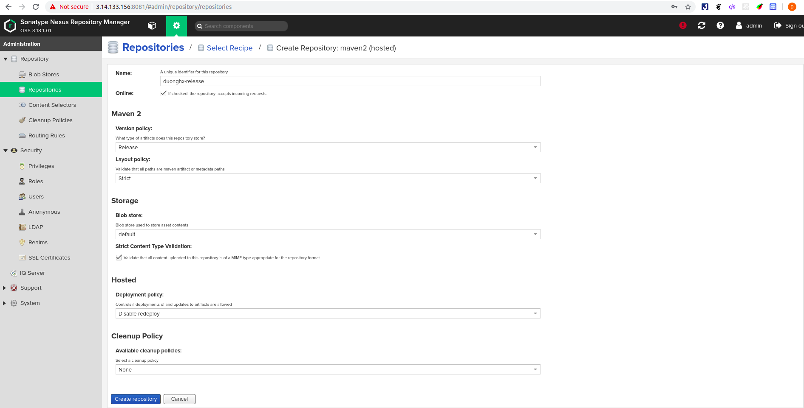
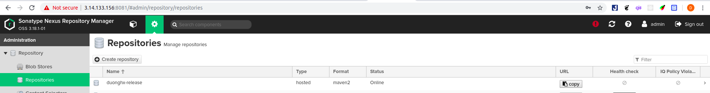

# Cấu hình java maven và đẩy artifactory lên nexus

## Mục lục :book:

1. [Những loại repository trên nexus](#type)
   - [Hosted Repository](#hosted)
   - [Proxy Repository](#proxy)
   - [Group Repository](#group)
2. [Đẩy artifactory lên nexus](#push)
3. [Quản lý phiên bản trên nexus](#manage)

---

<a id="type"></a>

## Những loại repository trên nexus :star:

Đầu tiên cần tìm hiểu những loại repository trên nexus.

<a id="hosted"></a>

### Hosted repository

- Hosted repository là repository chứa những denpendencies thuộc về nội bộ không public ra ngoài. Khi một ai đó trong dự án cần và muốn sử dụng những dependencies này thì chỉ việc đẩy những dependencies này lên một hosted repository sau đó người nào cần thì chỉ việc request tới hosted repository này để tải những dependencies về. Có 3 loại hosted là: release, snapshot, mixed.

<a id="proxy"></a>

### Proxy repository

- Đóng vai trò là proxy giúp ta có thể truy cập tới các repository bên ngoài. Để tránh cái việc download lại nhiều lần và nâng cao tốc độ download thông thường khi request đến proxy repository này maven repo sẽ check xem trên local đã có những dependencies ta cần đã có trên local chưa. Nếu chưa nó sẽ gửi request đến remote repository để tải những dependencies này về và save nó lại.

<a id="group"></a>

### Group repository

- Nơi ta có thể combine các repository khác nhau vào.

---

<a id="push"></a>

## Đẩy artifactory lên Nexus

- Đầu tiên tạo một hosted repository trên nexus với version policy là release:

- Cách tạo một hosted repository:
  - Setting >> Repository >> Repositories >> Create repository >> maven2 (hosted) >> Fill thông tin vào mẫu:
  - ***Name:*** Tên của repository
  - ***If checked, the repository accepts incoming request:*** Cho phép disable or enable repo này
  - ***version policy:*** Có ba loại release, snapshot, mixed trong đó release là những dependencies được duyệt để sử dụng với một version nhất định. Còn snapshot là những version tạm thời. mixed là tập hợp cả release và snapshot.
  - ***Layout policy:*** Có tuân theo maven repo format hay không, strict là tuân thủ hoàn toàn, permissive là cho phép vi phạm
  - ***Storage:*** default
  - ***Dependency:*** cho phép re-deploy, hay không hoặc chỉ cho phép readonly.

- Tham khảo: [Maven Repository Format](https://help.sonatype.com/repomanager3/formats/maven-repositories).

- Có thể tạo một maven repository như sau:



- Chọn create repository. Vậy là đã tạo xong một Maven Repository trên nexus.



- Tiếp đó ta tiến hành cài đặt [Maven trên ubuntu](https://www.vultr.com/docs/install-apache-maven-on-ubuntu-18-04)

- Sau đó clone một simple project trên gitlab về [simple code java](https://gitlab.com/gitlab-examples/maven/simple-maven-dep.git)

```git
gcl https://gitlab.com/gitlab-examples/maven/simple-maven-dep.git
```

- ***gcl***: là lệnh rút gọn của ```git clone``` khi cài đặt ***zsh** đã có sẵn một plugin là git.

- Vào folder chứa project và thêm vào file pom như sau:

```xml
<distributionManagement>
   <repository>
     <id>release</id>
     <name>duonghx-release</name>
     <url>http://3.14.133.156:8081/repository/duonghx-release/</url>
   </repository>
</distributionManagement>
```

- Trong đó thẻ ***distributionManagement*** sẽ chỉ định sẽ nhận kho chứa remote nào để đẩy lên và đẩy lên như thế nào. Mặc định các phần tử bên trong ***distributionManagement*** sẽ sử dụng snapshot distribution nếu thẻ ***snapshotRepository*** không được định nghĩa.

- Sau đó vào trong file cài đặt của maven ```settings.xml``` .Trên linux file này thường được đặt trong ```/home/user/.m2/settings.xml```. Còn trên windows thì thường ở ```C:\User\name\.m2\settings.xml```. Mới đầu khi vào folder .m2 ta sẽ không thấy file này chạy lệnh ```vim settings.xml``` và lưu đoạn sau vào:

```xml
<settings xsi:schemaLocation="http://maven.apache.org/SETTINGS/1.1.0 http://maven.apache.org/xsd/settings-1.1.0.xsd"
     xmlns="http://maven.apache.org/SETTINGS/1.1.0" xmlns:xsi="http://www.w3.org/2001/XMLSchema-instance">
   <servers>
     <server>
       <id>release</id>
       <username>admin</username>  #tài khoản,mật khẩu admin trên nexus
       <password>********</password>
     </server>
   </servers>
 </settings>
```

- Về cơ bản các kho chứa phục vụ cho tải và deploy được định nghĩa trong thẻ ***repositories*** và ***distributionManament*** của file POM. Tuy nhiên những cài đặt về tài khoản và mật khẩu thì không nên để ở file POM, những thông tin này được đặt trong thẻ ***server*** của settings.xml.

- Sau đó trở lại với folder project và chaỵ lệnh ```mvn deploy``` nếu kết quả là ***build success*** lên nexus ta có kết quả như sau.

.

---

<a id="manage"></a>

## Quản lý phiên bản trên Nexus

- Như đã nói ở trên hosted repository có 3 loại: snapshot, release, mixed. Ở đây ta sẽ quan tâm đến việc quản lý phiên bản với 2 loại snapshot và release repository.

- Đầu tiên SNAPSHOT đó là phiên bản mà chưa được phát hành.

- Ý tưởng là khi một bản 1.0 được phát hành hoặc bất kỳ bản phát hành nào khác đều tồn tại một bản ***1.0-SNAPSHOT*** đây là phiên bản có thể trở thành bản 1.0 hoàn chỉnh. Về cơ bản có nghĩa là 1.0 vẫn còn đang trong quá trình phát triển có thể là đã gần hoàn thiện chuẩn bị lên 1.0 hoặc mới hoàn thiện 0.9 chuẩn bị lên (tức là giữa 0.9 và 1.0 có một giai đoạn để phát triển và giai đoạn đó được thể hiện bằng ***SNAPSHOT***).

- Sự khác biệt giữa ***release*** và ***SNAPSHOT*** đó là phiên bản ***SNAPSHOT*** có thể nhận được cập nhật hàng ngày, khi mà hôm nay ta tải xuống bản ***1.0 SNAPSHOT*** tuy nhiên ngày mai bản snapshot có thể thay đổi khác với bản của hôm nay.

- Khi build một ứng dụng Maven sẽ tìm kiếm các dependencies trong một kho lưu trữ cục bộ. Nếu không tìm thấy ở đây Maven sẽ tìm trong các kho lưu trữ từ xa đã được cài đặt trong ***settings.xml hoặc POM.xml*** để truy xuất đến các dependencies này và nó sẽ được lưu trữ trong kho lưu trữ cục bộ và các lần build tiếp theo sẽ không cần tải lại nữa.

- Khi mà cần tải về một thư viện ***duonghx-1.0-SNAPSHOT*** vì là snapshot  Maven sẽ tự hiểu phiên bản này là không ổn định và nó sẽ cố gắng tìm kiếm trên kho lưu trữ từ xa mặc dù đã tồn tại một bản trên kho lưu trữ cục bộ.

- Việc kiểm tra trên kho lưu trữ mới ta có thể cài đặt trong file ***setting.xml*** như sau:

```xml
<repository>
    <id>duonghx-repository</id>
    <url>...</url>
    <snapshots>
        <enabled>true</enabled>
        <updatePolicy>XXX</updatePolicy>
    </snapshots>
</repository>
```

- Trong đó XXX:
  - **always**: Maven luôn kiểm tra các version mới với mỗi lần build.
  - **daily**: Giá trị mặc định luôn kiểm tra hàng ngày.
  - **interval**: Khoảng thời gian (tính bằng phút).
  - **never**: Maven sẽ không bao giờ lấy các phiên bản khác và nó chỉ kiểm tra khi không tồn tại phiên bản nào trên cục bộ.

- Đối với việc chỉ định một phiên bản là snapshot hay release ta tiến hành chỉnh sửa ở file ***POM.xml*** của ứng dụng với version có đuôi là ***-SNAPSHOT*** thì có nghĩa là phiên bản snapshot còn không là release.

```xml
  <groupId>com.example.dep</groupId>
  <artifactId>simple-maven-dep</artifactId>
  <packaging>jar</packaging>
  <version>1.0-SNAPSHOT</version>
  <name>simple-maven-dep</name>
  <url>http://maven.apache.org</url>
```