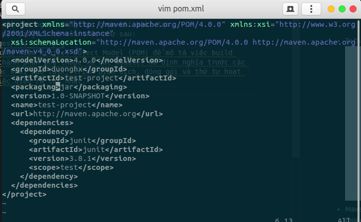
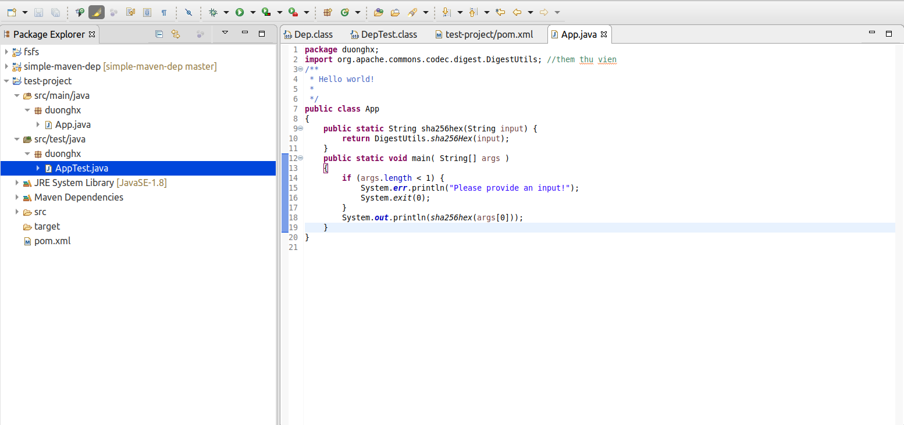
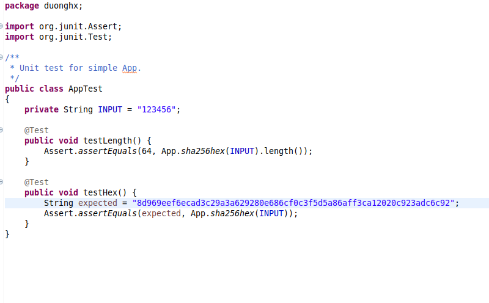

# Tạo một java maven project và đẩy source lên Gitlab.

## Mục lục :book:

1. [Tạo một java maven project](#create)
2. [Đẩy source lên gitlab](#push)

---

<a id="create"></a>

## Tạo một java maven project :wrench:

- Đầu tiên khởi tạo một template maven project với lệnh.

```s
mvn archetype:generate 
	-DgroupId={project-packaging}
	-DartifactId={project-name}
	-DarchetypeArtifactId={maven-template} 
	-DinteractiveMode=false
```

- Ví dụ: ```mvn archetype:generate -DgroupId=com.duonghx -DartifactId=test-project -DarchetypeArtifactId=maven-archetype-quickstart -DinteractiveMode=false```

- Trong đó:
  - ***groupId***: thường đặt theo tên của tổ chức hoặc nhóm tạo ra dự án.
  - ***artifactId***: thường lấy theo tên viết tắt của dự án.
  - ***archetypeArtifactId***: là loại dự án sẽ được tạo, Maven cung cấp nhiều kiểu mẫu có sẵn cho người dùng lựa chọn khi khởi tạo.

- Ta thu được một project có cấu trúc như sau:


- Maven dùng khái niệm Project Object Model (POM) để mô tả việc build project, các thành phần phụ thuộc và các module. Nó định nghĩa trước các target cho việc khai báo task, trình biên dịch, đóng gói và thứ tự hoạt động để mọi việc diến ra tốt nhất.

- Vào trong thư mục chứa project ta sẽ thấy file POM có cấu hình như sau:



- Ta tiến hành update file POM như sau:

- Đầu tiên thêm một phiên bản JDK cụ thể  để Maven có thể sử dụng để biên dịch source code.

```xml
<properties>
        <project.build.sourceEncoding>UTF-8</project.build.sourceEncoding>	
        <maven.compiler.source>1.8</maven.compiler.source>
        <maven.compiler.target>1.8</maven.compiler.target>
</properties>
```

- Thêm jUnit vào để thực hiện test.

```xml
<dependency>
		<groupId>junit</groupId>
		<artifactId>junit</artifactId>
		<version>4.12</version>
		<scope>test</scope>
</dependency>
```

- Thêm commons-codec cho việc hashing SHA. 

```xml
dependency>
		<groupId>commons-codec</groupId>
		<artifactId>commons-codec</artifactId>
		<version>1.11</version>
</dependency>
```

- Ta có file POM hoàn thiên như sau:


- Tiến hành viết code.



- test



---

<a id="push"></a>

## Đẩy source lên Gitlab :star:

- Để push,clone được project trên gitlab server ta phải add SSH Key.

- Chọn biểu icon ở góc trên bên phải màn hình chọn => Settings => SSH 
Keys => generate one

 

- Có thể làm theo hướng dẫn tùy thuộc vào từng hệ điều hành.

- Có thể tham khảo như sau:

  - Mở terminal trên linux

  - Tạo mới một RSA SSH key pair:```ssh-keygen -t rsa```

  - Gõ lệnh ```cat ~/.ssh/id_rsa.pub``` để lấy public key.
  
  - Sau đó trở về phần điền SSH Keys như hình trên và điền public key vào.
  
  - Để kiểm tra đã cài đặt đúng hay chưa chạy lệnh ```ssh -T git@gitlab.example.com```

  - Đến giờ ta đã có thể đẩy source lên gitlab.
  
  - Tiến hành tạo project mới.
  
  - Làm theo các lệnh trong file Readme.md để push project lên.


