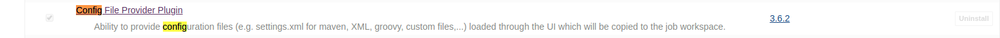
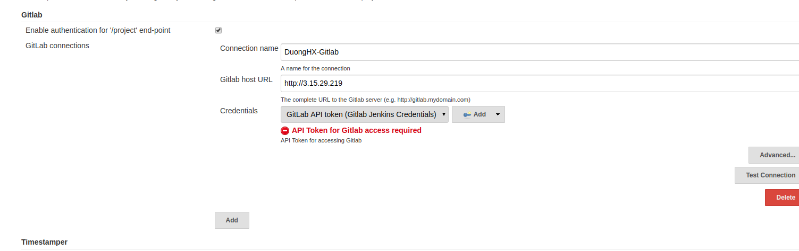
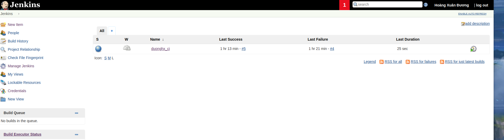
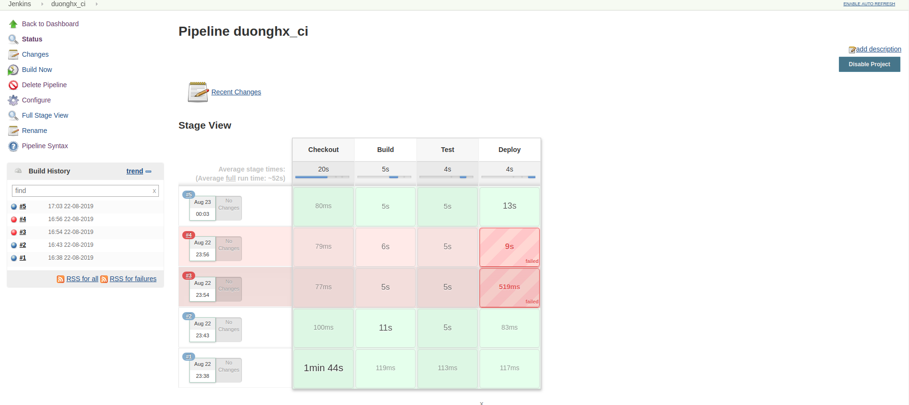

# Chạy CI với Jenkins :star:

## Mục lục :book:
1. [Chuẩn bị plugin và cấu hình cần thiết](#prepare)
   - [Tạo node](#create)
   - [Tạo tệp cấu hình maven toàn cục](#create-global)
   - [Cấu hình Gitlab Plugin trong Jenkins](#config-gilab)
   - [Tạo một job](#create-job)
3. [Cấu hình job để chạy CI và đẩy artifactory lên nexus](#config-job)

---

<a id="prepare"></a>

## Chuẩn bị plugin và cấu hình cần thiết :gear:

- Đầu tiên truy cập vào jenkins ```Manage Jenkins >> Manage Plugins >> Available``` để cài đặt một số tool cần thiết như: ***Gitlab Plugin***,***Conffig File Provider Plugin*** 


- Trong đó:
  - ***Gitlab Plugin***: Giúp kích hoạt các lần build cho Jenkins mỗi khi có source code mới được đẩy lên gitlab hoặc gộp nhánh.
  - ***Conffig File Provider Plugin***: Giúp cho các file cấu hình (ví dụ settings.xml) khả dụng trong không gian làm việc cục bộ. Tất cả các file được cấu hình trong plugin này đều khả dụng và có thể tham chiếu đến để sử dụng.

<a id="create"></a>

### Tạo node

- Đầu tiên vào ```Manage Jenkins >> Configure Global Security >> TCP port for inbound agents >> Random``` mở một cổng bất kỳ để cho một agent có thể kết nối đến.


- Quay lại phần ```Manage Jenkins >> Manage Nodes >> New Nodes``` để tiến hành tạo một slave agent có thể kết nối tới jenkins việc chạy ci sẽ được thực hiện trên slave agent này.

- Tiến hành điền ```Node Name``` và chọn ```Permanent Agent >> OK``` hoặc cũng có thể tạo một node mới dựa trên node đã có sẵn với ```Copy Existing 
Node``` điền tên node muốn copy vào.


- Trong hình trên:
  - ***Name:*** là tên node.
  - ***Description:*** Là phần mô tả.
  - ***Number of executors:*** là số lần build hiện tại cùng chạy trên con node này.
  - ***Remote root directory:*** Là không gian làm việc chứa những job mà chạy trên node này.
  - ***Labels hay còn là nhãn:*** Khi muốn nhóm các agent và một nhóm logic. Ví dụ khi ta có nhiều Windows Agent và ta muốn một job chạy bất kỳ trên nhóm Windows Agent này ta có thể cấu hình cho nó chỉ chạy trên một trong những agent này.
  - ***Launch method:***  Lauch agent by connecting it to master(cũng giống start via JavaWeb) bởi không còn option start via JavaWeb.

- Sau khi điền đầy đủ thông tin xong click save.


- Có thể chọn 1 trong 2 cách như hình trên để kết nối node và jenkins.

<a id="create-global"></a>

### Tạo tệp cấu hình maven toàn cục

- Tiến hành tạo một file Global Maven ```settings.xml``` để có thể tham chiếu đến từ một job để sử dụng những setting này.
- Chọn ```Manage Jenkins >> Manage Files >> Add a new Config >> Global Maven settings.xml >> Submit``` tiến hành chỉnh sửa file config sao cho phù hợp rồi tiến hành submit. Nên lưu lại ID để có thể dùng khi config một job.

<a id="config-gitlab"></a>

### Cấu hình Gitlab Plugin trong Jenkins

- Sau khi cài xong plugin như phần trên ta vào ```Manage Jenkins >> Configure System >> Gitlab``` điền đầy đủ thông tin vào như sau.



- Về phần Credentials ta phải lên Gitlab để lấy Access Token tiến hành bấm vào biểu tượng người dùng góc trên cùng bên phải >> Settings >> Access Tokens >> Tiến hành grant quyền cho access token này copy và add vào trên jenkins.

<a id="create-job"></a>

### Tạo một job

- Trở về dashboard >> new items >> nhập tên job >> chọn loại job là pipeline. Ví dụ tạo một job là duoghx_ci ta được kết quả như hình.



---

<a id="config-job"></a>

## Cấu hình job để chạy CI và đẩy artifactory lên nexus

- Tiến hành config job để chạy CI >> chọn một job >> chọn Configure ta sẽ thấy giao diện sau:


- Chọn ***Do not allow concurent build*** để không chạy 2 lần build liên tiếp cùng một lúc.

- Chọn ***Build when a change is pushed to Gitlab*** để khi có một thay đổi được đẩy lên gitlab sẽ tự động chạy job này.

- Viết script để chạy ci ở phần pipeline:

```groovy
pipeline {
    agent {
        label 'duonghx'
    }

    stages {
        stage('Checkout') {
            steps {
              checkout([$class: 'GitSCM', branches: [[name: '*/master']], doGenerateSubmoduleConfigurations: false, extensions: [], submoduleCfg: [], userRemoteConfigs: [[credentialsId: 'Gitlab2', url: 'http://3.15.29.219/root/test_project.git']]])
            } 
        }

        stage("Build") {
            steps {
                sh "mvn package"
            }
        }

        stage("Test") {
            steps {
                sh "mvn test"
            }
        }

        stage("Deploy") {
            steps{
            configFileProvider(
            [configFile(fileId: '39ce3d7a-6301-44e1-9095-8301874947cc', variable: 'MAVEN_SETTINGS')]) {
            sh 'mvn -s $MAVEN_SETTINGS deploy'
            }
        }
		}
    }
    post{
        always{
            deleteDir() //Sau khi chay xong clear workspace.
        }
    }
}
```

- Ở trên là một Jenkins Pipeline dựa trên syntax của DSL (Domain Specific Language) ngôn ngữ chính là Groovy.

- Jenkins Pipeline có hai loại đó là:
  - ***Declarative Pipeline***: chính là Jenkins Pipeline ở trên dựa trên các methods và function dựng sẵn việc ta cần làm là tuân thủ theo các rule,syntax tương ứng với từng steps.
  - ***Scripted Pipeline***: Sử dụng Groovy Script để implement các task vào hoặc logic tùy thuộc bài toán.

- Như đã biết ở trên là một ***Declarative Pipeline*** vì vậy top-level của nó sẽ là ```pipeline{}```
    - ***agent***: chính là môi trường để chạy pipeline script, shell script trên đó. Agent chính là máy mà mình chạy các đoạn script trên đó có thể là jenkins master, slave machine, shell script.
      - ***any***: sẽ chỉ định cho bất cứ node nào khả dụng chạy.
      - ***none***: tức là không sử dụng bất cứ node nào bù lại phải chỉ định rõ ràng node nào sẽ chạy ở ***stages*** bên dưới.
      - ***label***: là tên của agent tức là chỉ định chính xác một slave machine để chạy các ***stages*** bên dưới.
      - ***node***: giống lable nhưng có nhiều lựa chọn hơn.
      - ***docker***: sử dụng docker image để chạy pipeline.
    - ***post***: là cái sẽ chạy cuối cùng khi pipeline kết thúc. Thường được dùng để xử lý kết quả cuối cùng hoặc các tác vụ cần chạy.
      - ***always***: Sẽ luôn luôn chạy bất kể kết quả
      - ***changed***: Chạy khi kết quả hai lần build khác nhau
      - ***success, unstable, failure, aborted***: chạy khi kết quả lần lượt là ```SUCCESS```, ```UNSTABLE```, ```FAILURE```, ```ABORTED```
    - ***stages***: một ```stages``` có nhiều ```stage``` nhỏ. Mỗi stage đảm nhiệm một yêu cầu khác nhau tùy thuộc vào yêu cầu bài toán. Trong mỗi ```stage``` lại có các ```steps``` thường đặt các xử lý logic trong đó.

- Ở trên gồm có 4 bước đó là: ```Checkout```, ```Build```, ```Test```, ```Deploy``` tương ứng với các nhiệm vụ.
  - ***Checkout***: Sử dụng pipeline syntax để sinh tự động một đoạn template để tải project về ```WORKSPACE``` trên máy agent ở đây workspace chính là phần ```remote root directory``` trong lúc tạo node, những pipeline syntax này đơn giản chỉ là đoạn lệnh rút gọn thay vì chúng ta phải dùng git clone về. Ở đây ta sẽ check out source đã đẩy lên từ phần [Gitlab](../Push-To-Gitlab)
  - ***Build***: Có nhiệm vụ để build ứng dụng sử dụng lệnh ```sh``` để chạy shell script ở đây sử dụng ```mvn package``` để build vì mặc định là ta đang ở ```WORKSPACE``` mà source code đã được tải xuống ```WORKSPACE``` nên ta chỉ việc chạy lệnh buid.
  - ***Test***: Có nhiệm vụ chạy junit test và báo lại kết quả test.
  - ***Deploy***: Chính là phần đẩy artifact lên nexus. Ở đây ta đặt ```mvn -s $MAVEN_SETTINGS deploy``` trong configFileProvider chính là để sử dụng những cài đặt của file settings global ta đã tạo ở trên. Trong đó fileID là id của file setting đó, varible chính là biến để ta áp dụng setting đó về phần cấu hình file POM và file global ```settings.xml``` cấu hình tương tự như phần [Push Artifact Nexus](../Push-Artifact-Nexus)
- Sau khi đã cấu hình xong job ta quay về giao diện của job chọn ```Build``` để tiến hành chạy các stage trong Jenkins Pipeline.
- Ta sẽ thấy job sẽ chạy qua từng bước và sẽ hiển thị log lên màn hình.

