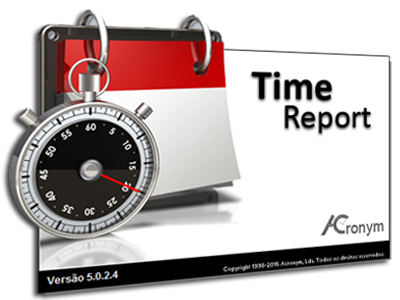

# HORENSO
ほうれんそう

## HORENSO là gì?
- Horenso là một trong những quy tắc quan trọng mà khi làm việc ở bất kỳ công ty nhật nào nhân viên cũng được đào tạo. Horenso không chỉ là phương pháp truyền thông liên lạc nội bộ mà còn là nét văn hóa của Nhật Bản.

- HORENSO là viết tắt của 3 từ sau:
  - HO - HOKOKU : Báo cáo  ほう
  - REM - RENKAKU : Liên lạc   れん
  - SO - SODAN : Bàn bạc   そう

### HO-HOKOKU: Báo cáo
- Ta phải nhận định rằng báo cáo là một nhiệm vụ quan trọng và bắt buộc phải làm. Để cho cấp trên có thể nắm được rõ tình hình công việc của mình đang làm, nếu không cấp trên sẽ không biết tiến độ công việc ra sao để đưa ra những hướng đi hợp lý. Không nên chờ cấp trên hỏi về tiến độ công việc, nên chủ động báo cáo công việc. 
- **Những điểm lưu ý về báo cáo:**
  - 
  - ***Thời điểm báo cáo.***
    - Khi kết thúc công việc được giao.
    - Với những task có thời gian dài nên báo cáo tiến độ công việc tránh việc thời gian quá dài mà cấp trên không biết tiến độ công việc đã đến đâu.
    - Khi có gì thay đổi khi làm task.
    - Khi thu thập được thông tin gì mới.
    - Khi gặp vấn đề.
    - Khi cần cải tiến công việc hoặc tìm ra phương pháp làm việc mới.
  - ***Thế nào là phương pháp báo cáo tốt.***
    - Thường xuyên, chính xác, đầy đủ, cái gì xấu nói trước tốt nói sau, văn phong phải lịch sự tôn trọng người nhận báo cáo.
    - Thông tin báo cáo phải có chọn lọc và đầy đủ.
    - Góp ý, đưa ra giải pháp luôn.
    - Trong vài trường hợp cấp bách có thể báo cáo bằng miệng trực tiếp luôn.
    - Có thể báo cáo bằng văn bản nếu nội dung đặc thù hay khó hiểu có thể dùng hình vẽ, biểu đồ ... cho dễ hiểu.
    - Báo cáo bằng mail.
  - ***Thế nào là phương pháp báo cáo không tốt.***
    - Ngẫu hững, không chính xác.
    - Quá ít thông tin.
    - Báo tin tốt trước.
    - Văn phong thiếu tôn trọng.
    - Chỉ hỏi và tham khảo.
### RENKAKU: Liên lạc
- Trong phương pháp horenso liên lạc là khó nhất 
