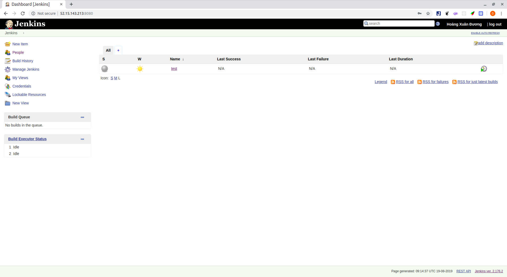

# Install Jenkins (Ubuntu)

## Install Evironment
- Đầu tiên tiến hành cài đặt java.
- Jenkins hỗ trợ:
  - OpenJDK JDK / JRE 8 - 64 bits
  - OpenJDK JDK / JRE 11 - 64 bits
- Tiến hành cài đặt java8 trên ubuntu ```apt install openjdk-8-jre-headless```.
- Sau khi cài đặt xong gõ ```java -version``` để kiểm tra phiên bản của java.
## Install Jenkins On Ubuntu 18.04
- Trên Debian-based distributions như là Ubuntu ta có thể cài đặt Jenkins thông qua apt.
- Thêm Jenkins Debian repository, nếu trả về kết quả là **OK** thì thì có nghĩa là key đã được thêm vào thành công và những packages từ repository này sẽ được xem là đáng tin cậy: 
  - ```wget -q -O - https://pkg.jenkins.io/debian/jenkins.io.key | sudo apt-key add -```
- Sau đó thêm Jenkins repository vào hệ thống với lệnh:
  - ```sudo sh -c 'echo deb https://pkg.jenkins.io/debian-stable binary/ > /etc/apt/sources.list.d/jenkins.list'```
- Sau khi Jenkins repository đã được kích hoạt tiến hành cài đặt Jenkins.
  - ```sudo apt update```
  - ```sudo apt install jenkins```
- Gói cài đặt này sẽ làm những việc sau:
  - Sau khi cài đặt nó sẽ cài đặt jenkins như một deamon (deamon nó giống như một chương trình chạy nền như service trên windows). Để có thêm thông tin xem trong ```/etc/init.d/jenkins ```
  - Tạo một user là jenkins để chạy service này.
  - Log được ghi vào trong file sau: ```/var/log/jenkins/jenkins.log``` khi jenkins bị lỗi có thể kiểm tra file này.
  - Lưu trữ những thông số cài đặt trong ```/etc/default/jenkins```
  - Cài đặt cho Jenkins lắng nghe ở cổng 8080.
- Sau khi cài đặt xong gõ ```systemctl status jenkins``` để kiểm tra trạng thái của jenkins.
  ## Config jenkins.
- Sau khi cài đặt xong Jenkins ta tiến hành cấu hình nó.
- Tiến hành truy cập vào Jenkins thông qua public ip của máy đó ví dụ: http://52.15.143.213:8080/.
- Sau đó ta sẽ thấy giao diện `Unlock Jenkins` như hình:

- Vào trong mục `/var/lib/jenkins/secrets/` và mở file ***initialAdminPassword*** copy mật khẩu vào dán vào ô như trong hình.
  - ```vi /var/lib/jenkins/secrets/initialAdminPassword```
  - ```Ouput:```
  - ```2115173b548f4e99a203ee99a8732a32```

- Nhấn ***Continue*** ta sẽ thấy một giao diện cài đặt jenkins như sau:
.
- Có thể chọn ***Install suggested plugins*** để cài đặt những plugin mặc định nếu không có thể chọn ***Select plugin to install*** để chọn những plugin cần cài đặt sau đó một bảng hiển thị tiến độ cài đặt sẽ hiện ra.
- Sau khi cài đặt xong plugin sẽ hiện lên một bảng để tạo admin user.
.
- Chọn ***Save and Continue*** cho kết quả như sau:
.