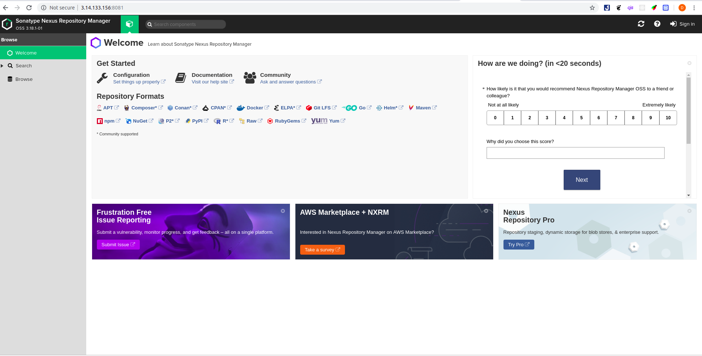
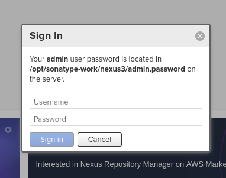

# Install Nexus

## Install Evironment.
- Tiến hành cài đặt java8. 
- Trước khi tiến hành cài đặt java cần tiến hành cập nhật các gói từ kho: ```sudo apt update```
- Tiếp đó tiến hành cài đặt java ```sudo apt install openjdk-8-jre-headless```
## Install Nexus.
- Tiến hành tải Nexus phiên bản mới nhất về ```wget https://download.sonatype.com/nexus/3/latest-unix.tar.gz``` trong thư mục opt.
- Tiến hành giải nén ```tar -zxvf nexus-3.18.1-01.tar.gz``` ta được 2 thư mục đó là ***nexus-3.18.1-01*** và ***sonatype-work*** một thư muc ứng dụng và một thư mục lưu dữ liệu.
- **Một thư mục ứng dụng bao gồm:**
  - ```install4j```
  - ```NOTICE.txt```
  - ```OSS-LICENSE.txt```
  - ```PRO-LICENSE.txt```
  - ```bin```
  - ```deploy```
  - ```etc```
  - ```lib```
  - ```public```
  - ```system```
- Trong đó:
  - ***OSS-LICENSE.txt, PRO-LINCENSE.txt and NOTICE.txt*** là những file mà bao gồm chi tiết pháp lý về mặt giấy phép và thông báo bản quyền.
  - ***bin*** thư mục này bao gồm những dòng lệnh liên quan đến việc chạy nexus và những file config liên quan đến việc chạy nó.
  - ***etc*** thư mục bao gồm những file configure.
  - ***lib*** thư mục này chứa những thư viện nhị phân liên quan đến Apache karaf.
  - ***public*** thư mục này bao gồm những tài nguyên mở của nexus.
  - ***system*** thư mục bao gồm tất cả những thành phần và plugin cấu tạo nên nexus.
- **Một thư mục dữ liệu bao gồm:** 
  - ```clean cache```
  - ```log```
  - ```orient```
  - ```tmp```
- Để chạy nexus chuyển đến thư mục /opt/nexus-3.18.1-01/bin rồi chạy lệnh ```./nexus run``` ngoài lệnh run còn có thể chạy các lệnh sau ```start```,```stop```,```restart```,```force-reload```,```status```.
- Sau khi chạy xong nexus truy cập vào địa chỉ ```http://<server_host>:<port>``` ví dụ ```http://localhost:8081/``` 

- Để có đầy đủ quyền truy cập thì cần phải dùng đến tài khoản admin khi lần đầu đăng nhập ta sẽ thấy thông báo nơi chứa mật khẩu tài khoản admin như sau:

## Run as service.
- Ta có thể cài đặt cho nexus để chạy như một service bằng systemd.
- Tạo một người dùng có đủ quyền để chạy service. Trong file ```opt/nexus-3.18.1-01/bin/nexus.rc```  ở đây chọn có thể chọn root sửa dòng ```run_as_user="root"```
- Sau đó symlink từ ***$installdir/bin/nexus*** tới ***/etc/init.d/nexus***.
- ```sudo ln -s /opt/nexus-3.18.1-01/bin/nexus /etc/init.d/nexus```
- Sau đó tạo một file service là ```nexus.service``` trong thư mục ```etc/systemd/system```. Và chèn nội dung sau vào:

```
[Unit]
Description=nexus service
After=network.target
  
[Service]
Type=forking
LimitNOFILE=65536
ExecStart=/opt/nexus-3.18.1-01/bin/nexus start
ExecStop=/opt/nexus-3.18.1-01/bin/nexus stop
User=nexus
Restart=on-abort
  
[Install]
WantedBy=multi-user.target
```

- Lưu lại file trên và chạy các lệnh sau để khởi động nexus.
```
systemctl daemon-reload
systemctl enable nexus.service
systemctl start nexus.service
```
- Trong đó ***daemon-reload*** để load lại các service.
- ***enable*** dùng để  service khởi động cùng với hệ thống.
- ***start*** là để chạy service.