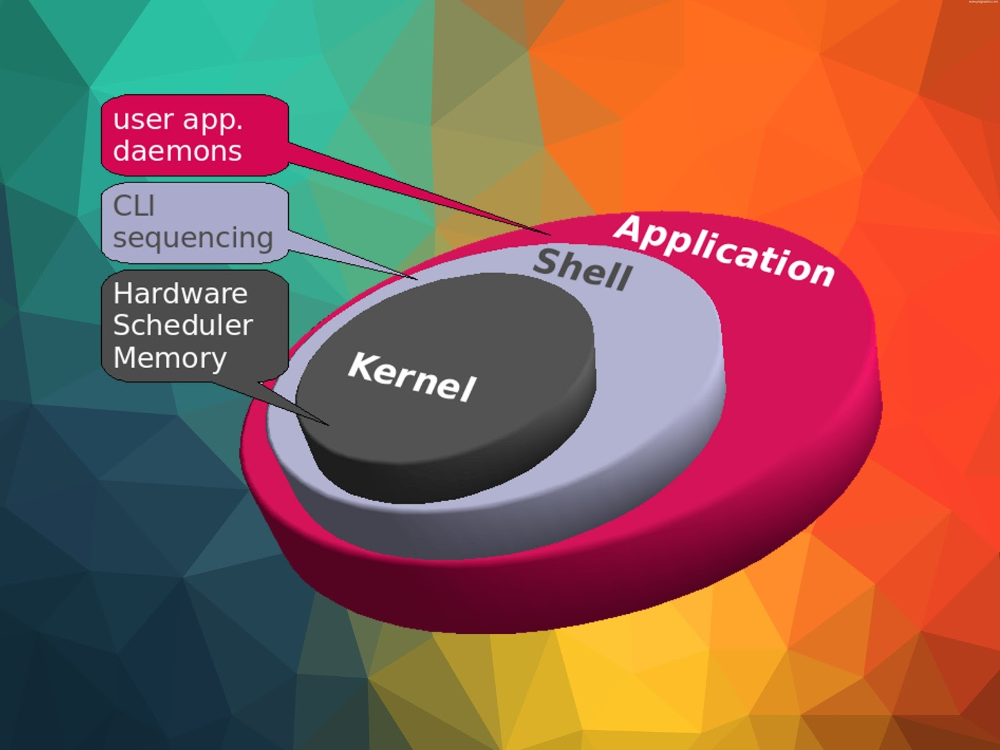
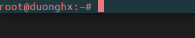
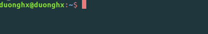
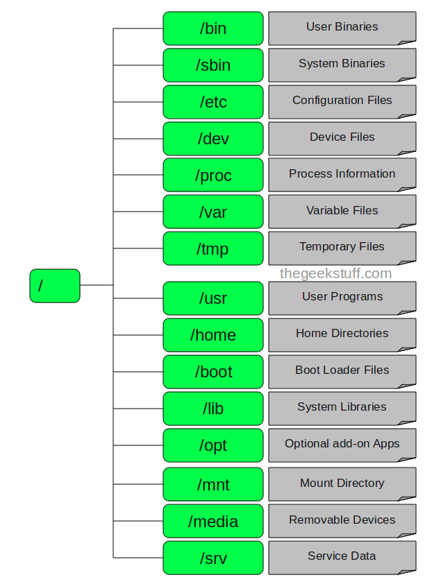

# Tự học linux

## Lịch sử phát triển.

- Là một hệ điều hành tương tự như Windows tuy nhiên linux hoàn toàn miễn phí và tùy ý phát triển tùy theo nhu cầu sử dụng.
- Lịch sử của Linux bắt đầu vào năm 1991 với sự bắt đầu của một dự án cá nhân của sinh viên Phần Lan Linus Torvalds để tạo ra một hạt nhân hệ điều hành tự do mới. Kể từ đó, các kết quả của nhân Linux đã được tăng trưởng liên tục trong suốt lịch sử của nó. 
- *Tham khảo thêm: [Wiki](https://vi.wikipedia.org/wiki/L%E1%BB%8Bch_s%E1%BB%AD_Linux)*

## Một số distro phổ biến của linux.

1. Debian
2. Ubuntu
3. RedHat Enterprise Linux
4. Centos
5. Kali Linux

## Cấu trúc hệ điều hành Linux.

### Tổng quan Linux.

- Cấu trúc linux chia làm 3 thành phần chính: Kernel, Shell, Applications.

#### Kernel.

- Thành phần quan trọng của mọi hệ điều hành và được ví như trái tim của hệ điều hành. Chứa các modules hay các thư viện để quản lý và giao tiếp giữa phần cứng và ứng dụng 

#### Shell.

- Trên Kernel là Shell có chức năng thực thi các lệnh(command) từ người dùng hoặc từ các ứng dụng, tiện ích chuyển đến cho Kernel xử lý.
- Là phiên dịch viên, trung gian giữa Application và Kernel có tác dụng biên dịch các lệnh từ Application cho Kernel. Cũng có khả năng bảo vệ kernel từ các yêu cầu không hợp lệ.
- Các loại shell:
  - sh (the Bourne Shell): đây là shell nguyên thủy của UNIX được viết bởi Stephen Bourne vào năm 1974. Đến nay shell sh vẫn sử dụng rộng rãi.
  - bash(Bourne-again shell): đây là shell mặc định trên linux.
  - csh (C shell): shell được viết bằng ngôn ngữ lập trình C, được viết bởi Bill Joy vào năm 1978.
  - Ngoài ra còn có các loại shell khác như: ash (Almquist shell), tsh (TENEX C shell), zsh (Z shell).
- Dấu nhắc Shell thay đổi tùy thuộc vào tài khoản user đang làm việc.
  - User root:

    
  - User thường:

    

#### Application.

- Là các ứng dụng, tiện ích mà người dùng cài đặt trên máy tính và sử dụng nó hàng ngày. Ví dụ như: ftp, samba, Proxy... hay chính giao diện GNOME mà ta thấy là Application.

### Cấu trúc file.

#### "/" - Root

- Là thư mục gốc là nơi bắt đầu của các file và thư mục. Chỉ root user mới có thể ghi trong thư mục này. /root là thư mục home của root user chứ không phải là /.

#### /bin - Chương trình người dùng

- Chứa các file binary của các tệp lệnh linux. Các lệnh chung của Linux được sử dụng bởi tất cả người dùng được lưu ở đây như: ps, ls, ping...

#### /sbin - Chương trình hệ thống

- Tương tự như /bin, nhưng chỉ chứa những lệnh được dùng bởi quản trị hệ thống, tương đương root user. Ví dụ: reboot, fdisk, iptables...

#### /etc - Các file cấu hình

- Thư mục này chứa các file cấu hình hệ thống và ứng dụng, đồng thời nó cũng chứa các shell script dùng để khởi động hoặc tắt các chương trình khác. Ví dụ: /etc/resolv.conf, /etc/logrolate.conf

#### /dev - Các file thiết bị

- Các phân vùng ổ cứng, các thiết bị ngoại vi như USB, ổ đĩa ngoài hay bất kỳ thiết bị nào gắn vào hệ thống đều được lưu ở đây. Mỗi thiết bị đều có file đại diện và được đặt tên theo một logic nhất định:
  - cdrom: đĩa CDRom/DVD
  - fd*: Đĩa mềm
  - hd*: Đĩa cứng IDE
  - sd*: Đĩa cứng SCSI

#### /proc - Thông tin về các tiến trình

- Thông tin về các tiến trình đang chạy sẽ được lưu trong /proc dưới dạng hệ thống file thư mục mô phỏng. Đây cũng là nơi lưu thông tin về các tài nguyên đang sử dụng của hệ thống.

#### /var - File về biến của chương trình

- Thông tin về biến của hệ thống được lưu ở thư mục này. Như các thông tin về log file: /var/log.

#### /tmp - Thư mục tạm thời

#### /urs - Chương trình của người dùng

- Đây là thư mục chứa các ứng dụng và tệp sử dụng bởi người dùng, trái ngược với ứng dụng và tệp sử dụng bởi hệ thống.