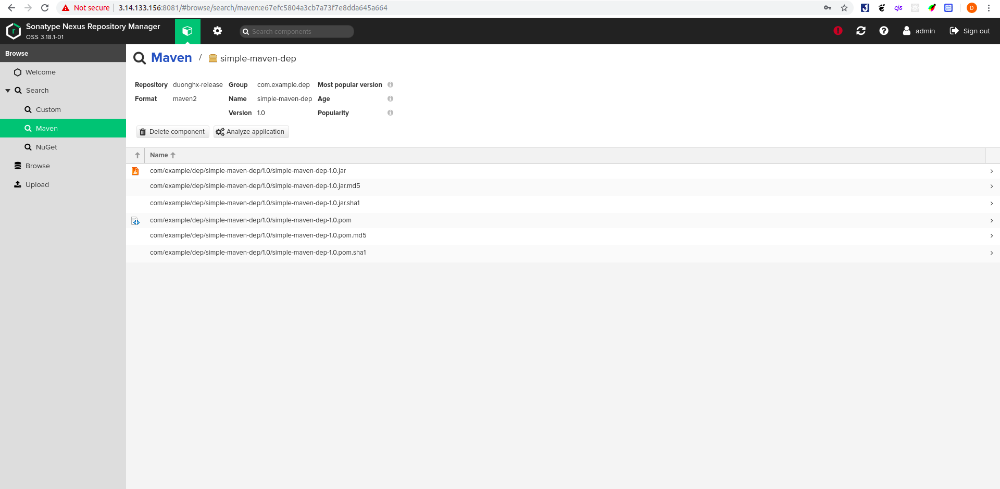

# Config Java maven push artifactory to Nexus

## Type of repository on nexus.
Đầu tiên cần tìm hiểu những loại repository trên nexus.

### Hosted repository.
- Hosted repository là repository chứa những denpendencies thuộc về nội bộ không public ra ngoài. Khi một ai đó trong dự án cần và muốn sử dụng những dependencies này thì chỉ việc đẩy những dependencies này lên một hosted repository sau đó người nào cần thì chỉ việc request tới hosted repository này để tải những dependencies về. Có 3 loại hosted là: release, snapshot, mixed.

### Proxy repository.
- Đóng vai trò là proxy giúp ta có thể truy cập tới các repository bên ngoài. Để tránh cái việc download lại nhiều lần và nâng cao tốc độ download thông thường khi request đến proxy repository này maven repo sẽ check xem trên local đã có những dependencies ta cần đã có trên local chưa. Nếu chưa nó sẽ gửi request đến remote repository để tải những dependencies này về và save nó lại.

### Group repository.
- Nơi ta có thể combine các repository khác nhau vào.

## Push artifactory to Nexus.
- Đầu tiên tạo một hosted repository trên nexus với version policy là release:
- Cách tạo một hosted repository:
  - Setting >> Repository >> Repositories >> Create repository >> maven2 (hosted) >> Fill thông tin vào mẫu:
  - ***Name:*** Tên của repository
  - ***If checked, the repository accepts incoming request:*** Cho phép disable or enable repo này
  - ***version policy:*** Có ba loại release, snapshot, mixed trong đó release là những dependencies được duyệt để sử dụng với một version nhất định. Còn snapshot là những version tạm thời. mixed là tập hợp cả release và snapshot.
  - ***Layout policy:*** Có tuân theo maven repo format hay không, strict là tuân thủ hoàn toàn, permissive là cho phép vi phạm
  - ***Storage:*** default
  - ***Dependency:*** cho phép re-deploy, hay không hoặc chỉ cho phép readonly.
- Tham khảo: [Maven Repository Format](https://help.sonatype.com/repomanager3/formats/maven-repositories).
- Có thể tạo một maven repository như sau:

- Chọn create repository. Vậy là đã tạo xong một Maven Repository trên nexus.

- Tiếp đó ta tiến hành cài đặt [Maven trên ubuntu](https://www.vultr.com/docs/install-apache-maven-on-ubuntu-18-04)
- Sau đó clone một simple project trên gitlab về [simple code java](https://gitlab.com/gitlab-examples/maven/simple-maven-dep.git)
- ```gcl https://gitlab.com/gitlab-examples/maven/simple-maven-dep.git```
- Vào folder chứa project và thêm vào file pom như sau:
```
<distributionManagement>
   <repository>
     <id>release</id>
     <name>duonghx-release</name>
     <url>http://3.14.133.156:8081/repository/duonghx-release/</url>
   </repository>
</distributionManagement>
```
- Sau đó vào trong file ```settings.xml``` .Trên linux file này thường được đặt trong ```/home/user/.m2/settings.xml```. Còn trên windows thì thường ở ```C:\User\name\.m2\settings.xml```. Mới đầu khi vào folder .m2 ta sẽ không thấy file này chạy lệnh ```vim settings.xml``` và save đoạn sau vào:
```
<settings xsi:schemaLocation="http://maven.apache.org/SETTINGS/1.1.0 http://maven.apache.org/xsd/settings-1.1.0.xsd"
     xmlns="http://maven.apache.org/SETTINGS/1.1.0" xmlns:xsi="http://www.w3.org/2001/XMLSchema-instance">
   <servers>
     <server>
       <id>release</id>
       <username>admin</username>  #tài khoản,mật khẩu admin trên nexus
       <password>********</password>
     </server>
   </servers>
 </settings>
```
- Sau đó trở lại với folder project và chaỵ lệnh ```mvn deploy``` nếu kết quả là ***build success*** lên nexus ta có kết quả như sau. 
.
