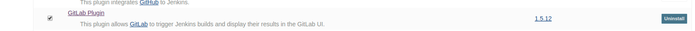
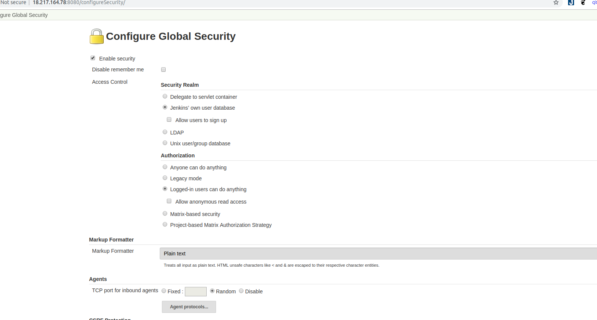
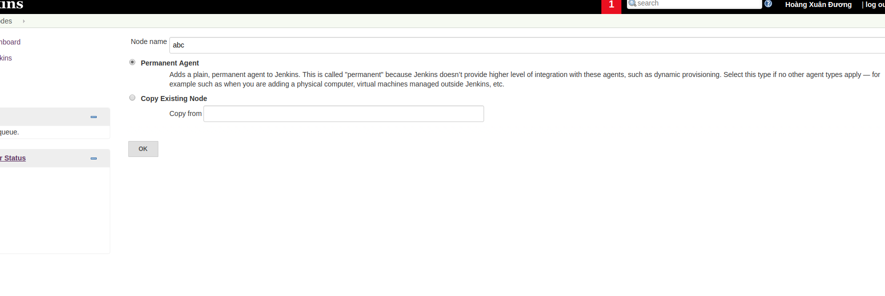
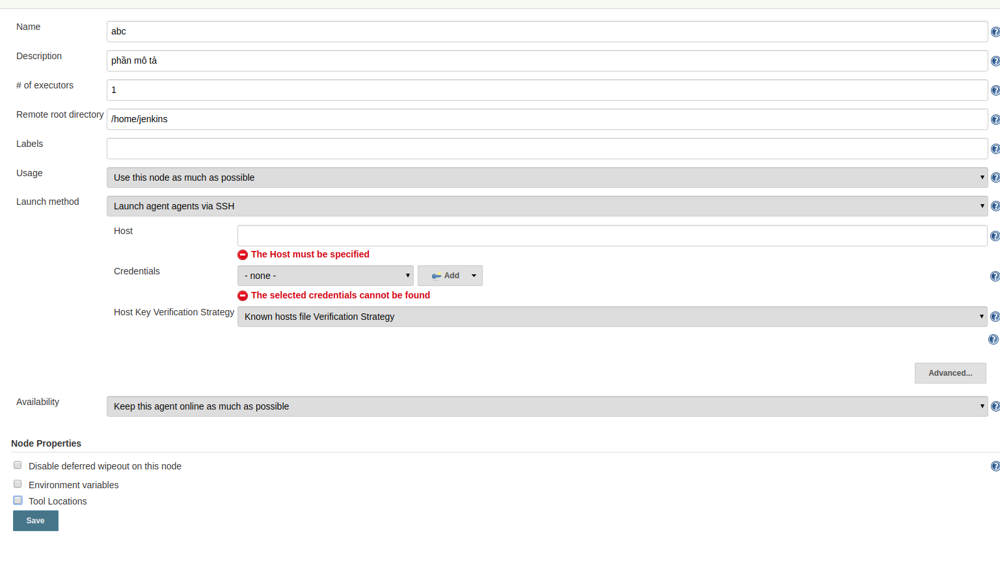
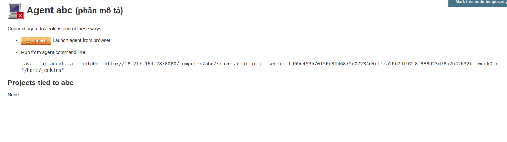
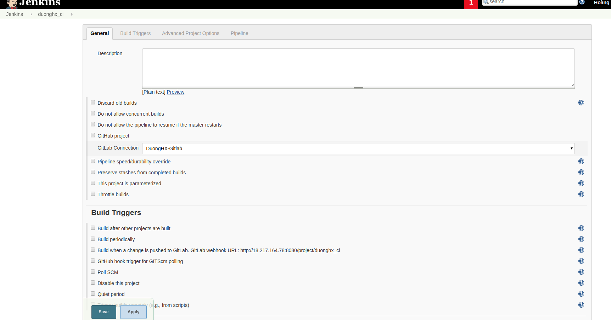
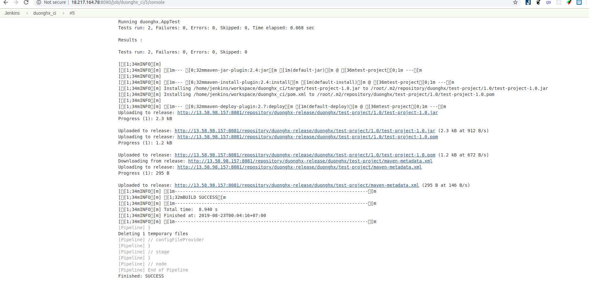

# Run CI on Jenkins.

## Prepare.
- Đầu tiên truy cập vào jenkins ```Manage Jenkins >> Manage Plugins >> Available``` để cài đặt một số tool cần thiết như: ***Gitlab Plugin***,***Conffig File Provider Plugin*** 


- Trong đó:
  - ***Gitlab Plugin***: Giúp kích hoạt các lần build cho Jenkins mỗi khi có source code mới được đẩy lên gitlab hoặc gộp nhánh.
  - ***Conffig File Provider Plugin***: Giúp cho các file cấu hình (ví dụ settings.xml) khả dụng trong không gian làm việc cục bộ. Tất cả các file được cấu hình trong plugin này đều khả dụng và có thể tham chiếu đến để sử dụng.
## Create node.
- Đầu tiên vào ```Manage Jenkins >> Configure Global Security >> TCP port for inbound agents >> Random``` mở một cổng bất kỳ để cho một agent có thể kết nối đến.

- Quay lại phần ```Manage Jenkins >> Manage Nodes >> New Nodes``` để tiến hành tạo một slave agent có thể kết nối tới jenkins việc chạy ci sẽ được thực hiện trên slave agent này.
- Tiến hành điền ```Node Name``` và chọn ```Permanent Agent >> OK``` hoặc cũng có thể tạo một node mới dựa trên node đã có sẵn với ```Copy Existing Node``` điền tên node muốn copy vào.


- Trong hình trên:
  - ***Name:*** là tên node.
  - ***Description:*** Là phần mô tả.
  - ***Number of executors:*** là số lần build hiện tại cùng chạy trên con node này.
  - ***Remote root directory:*** Là không gian làm việc chứa những job mà chạy trên node này.
  - ***Labels hay còn là nhãn:*** Khi muốn nhóm các agent và một nhóm logic. Ví dụ khi ta có nhiều Windows Agent và ta muốn một job chạy bất kỳ trên nhóm Windows Agent này ta có thể cấu hình cho nó chỉ chạy trên một trong những agent này.
  - ***Launch method:***  Lauch agent by connecting it to master(cũng giống start via JavaWeb) bởi không còn option start via JavaWeb.

- Sau khi điền đầy đủ thông tin xong click save.

- Có thể chọn 1 trong 2 cách như hình trên để kết nối node và jenkins.
## Create Global Maven settings.xml
- Tiến hành tạo một file Global Maven ```settings.xml``` để có thể tham chiếu đến từ một job để sử dụng những setting này.
- Chọn ```Manage Jenkins >> Manage Files >> Add a new Config >> Global Maven settings.xml >> Submit``` tiến hành chỉnh sửa file config sao cho phù hợp rồi tiến hành submit. Nên lưu lại ID để có thể dùng khi config một job.
## Config Gitlab Plugin in Jenkins.
- Sau khi cài xong plugin như phần trên ta vào ```Manage Jenkins >> Configure System >> Gitlab``` điền đầy đủ thông tin vào như sau.

- Về phần Credentials ta phải lên Gitlab để lấy Access Token tiến hành bấm vào biểu tượng người dùng góc trên cùng bên phải >> Settings >> Access Tokens >> Tiến hành grant quyền cho access token này copy và add vào trên jenkins.
## Create a Job.
- Trở về dashboard >> new items >> nhập tên job >> chọn loại job là pipeline. Ví dụ tạo một job là duoghx_ci ta được kết quả như hình.


## Config job.
- Tiến hành config job để chạy ci >> chọn một job >> chọn Configure ta sẽ thấy giao diện sau:

- Viết script để chạy ci ở phần pipeline:
```
pipeline {
    agent {
        label 'duonghx'
    }

    stages {
        stage('Checkout') {
            steps {
              checkout([$class: 'GitSCM', branches: [[name: '*/master']], doGenerateSubmoduleConfigurations: false, extensions: [], submoduleCfg: [], userRemoteConfigs: [[credentialsId: 'Gitlab2', url: 'http://3.15.29.219/root/test_project.git']]])
            } 
        }

        stage("Build") {
            steps {
                sh "mvn package"
            }
        }

        stage("Test") {
            steps {
                sh "mvn test"
            }
        }

        stage("Deploy") {
            steps{
            configFileProvider(
            [configFile(fileId: '39ce3d7a-6301-44e1-9095-8301874947cc', variable: 'MAVEN_SETTINGS')]) {
            sh 'mvn -s $MAVEN_SETTINGS deploy'
            }
        }
		}
    }
    post{
        always{
            deleteDir() //Sau khi chay xong clear workspace.
        }
    }
}
```

- Gồm 4 buốc: checkout source code về, Build, Test, Deploy.
- Phần checkout có thể tham khảo trong phần pipeline syntax ở cuối của script hoặc bên trong job để tự động genarate.
- Phần deploy ta có thể thấy sử dụng những cấu hình của file settings ta đã tạo ở trên.
- Chọn save và tiến hành build ta sẽ thấy phần log chạy khi bấm vào build number và hiển thị status của từng bước trong job.

